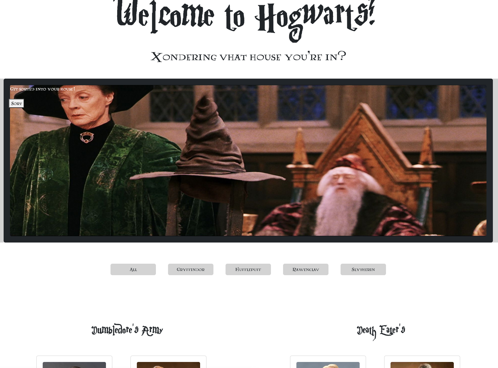

Sorting Hat Project

This project has a form to enter in student information to sort them into a house, and any expelled students move to the Dark Side.

https://soft-babka-1a9f0f.netlify.app/

## About the User 
- The ideal user for this application is a student.
- They want to know what house they will be sorted into.

## Features 
- When a new student is submitted to the form they are added as an object to the student array.
- They are randomly assigned to a house.
- House buttons filter depending on what house each student is in.
- If a student is expelled their card gets moved to the other array of Death Eaters.

## Video Walkthrough of Sorting Hat Project
https://www.loom.com/share/7e521f3014d94aa4bc185f16cb74f1df

## Relevant Links <!-- Link to all the things that are required outside of the ones that have their own section -->
- [Netlify] https://soft-babka-1a9f0f.netlify.app/
- [Wireframe + Project Board](https://docs.google.com/presentation/d/1S9zR4qWtY-phIwWgEv_HBgBGZpaKF44fpS9WiK2_qFQ/edit#slide=id.g14de1b60d77_0_0)

## Project Screenshots 

## Contributors
- Van Hoang (https://github.com/vhoang11)
